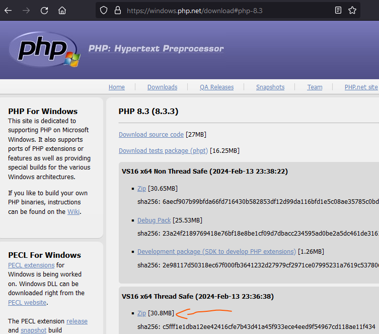
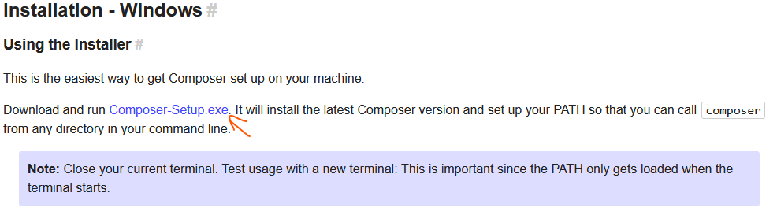
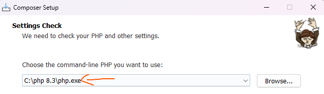
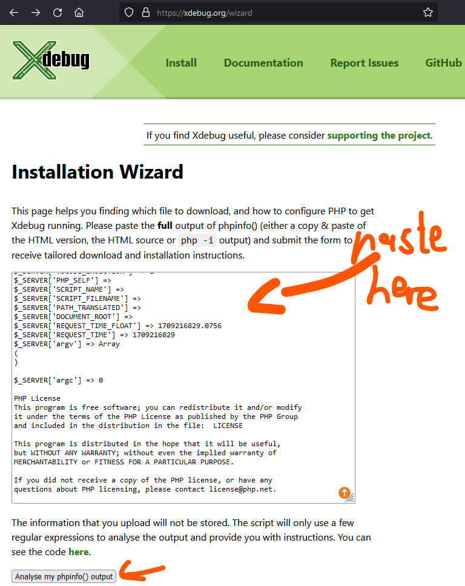
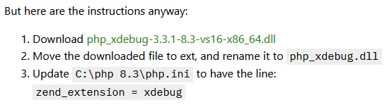
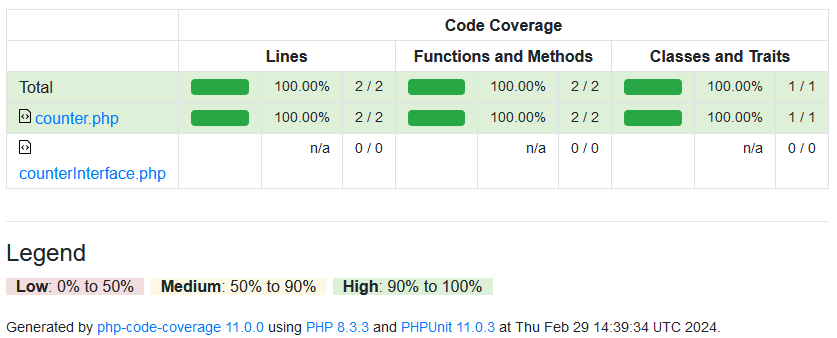

# How to use PHPUnit

https://phpunit.de/getting-started/phpunit-11.html

# Requirements:

- PHP<br>
  https://windows.php.net/download#php-8.3<br>
  <br>
  Download and unzip PHP.
- Composer<br>
  https://getcomposer.org/doc/00-intro.md#installation-windows<br>
  <br>
  Install composer, this will add it to your windows PATH to use it in the terminal.<br>
  <br>
  Make sure that this is the path to your unzipped php.exe!

# Setup project

- Run `composer require --dev phpunit/phpunit`
- Run `composer require php`
- Add a `tests` directory for your XYZ...Test.php unit tests.
- Add a `src` directory for your php application code.
- Add `autoload` to your composer.json so that PHPUnit will be able to access the source files in your src directory like this:

```json
  "autoload": {
    "psr-4": {
      "App\\": "src/"
    }
  },
```

- Add a phpunit.xml so that PHPUnit will look for tests in the tests folder like this:

```xml
<?xml version="1.0" encoding="UTF-8"?>
<phpunit
    stopOnFailure="false">
    <testsuites>
        <testsuite name="Tests">
            <directory>./tests</directory>
        </testsuite>
    </testsuites>
</phpunit>
```

- Add a `tests` script to your composer.json to run your tests in the tests directory like this:

```json
  "scripts": {
    "tests": "phpunit --color=always"
  }
```

- Your `composer.json` should look like this now:

```json
{
  "autoload": {
    "psr-4": {
      "App\\": "src/"
    }
  },
  "require": {
    "php": "*"
  },
  "require-dev": {
    "phpunit/phpunit": "^11.0"
  },
  "scripts": {
    "tests": "phpunit --color=always"
  }
}
```

- You're now ready to write your php application, as well as your unit tests!

# Example

- You add the `counterInterface.php` file into your src directory with the following code:

```php
<?php

namespace App;

interface Counter
{
    public function increment(): void;
    public function getCount(): int;
}
```

- Now, you write a test for the Counter class you will implement after the test!<br>
  Add the `counterTest.php` file to your tests directory, with the following code:

```php
<?php

declare(strict_types=1);

use PHPUnit\Framework\TestCase;
use App\Counter;

class CounterTest extends TestCase
{
    public function testCounter(): void
    {
        $demo = new Counter();
        for ($i = 0; $i < 10; $i++) {
            $demo->increment();
        }

        $count = $demo->getCount();
        $this->assertEquals(
            10,
            $count,
            "After 10 increments,
            the counter should return a count of 10!
            But the count was $count!"
        );
    }
}
```

- run your test: `composer tests`<br>
  And you get the following error:

```
There was 1 error:

1) CounterTest::testCounter
Error: Class "App\Counter" not found
```

This is to be expected as we have not implemented the Counter class in our src directory yet!

- Add the new file `counter.php` in the src directory, with the following code:

```php
<?php

namespace App;

class Counter
{
    private $count = 0;
    public function increment(): void
    {
        $this->count++;
    }
    public function getCount(): int
    {
        return $this->count;
    }
}
```

- As we have now implemented the Counter class, it is time to check if it passes our `testCounter` test in the counterTest.php file.<br>
  For that we run `composer tests`:

```
There was 1 error:

1) CounterTest::testCounter
Error: Class "App\Counter" not found
```

If you run in this error run `composer update` and run `composer tests` again, as composer is not aware of the Counter class yet!

As we implemented the Counter class correctly, we get the following result:

```
.                                                                   1 / 1 (100%)

Time: 00:00.006, Memory: 6.00 MB

OK (1 test, 1 assertion)
```

🎊 Congrats you just did test driven development 🎊<br>
From here on, your good to go.

- But when we introduce a bug on purpose, we can see that our unit test will let us know immediately:<br>
  Let's change `private $count = 0;` to `private $count = 1;` in counter.php and run `composer tests` again:

```
F                                                                   1 / 1 (100%)

Time: 00:00.013, Memory: 8.00 MB

There was 1 failure:

1) CounterTest::testCounter
After 10 increments,
            the counter should return a count of 10!
            But the count was 11!
Failed asserting that 11 matches expected 10.

C:\Users\roman\Desktop\Nachhilfe\PHPUnit\tests\counterTest.php:18

FAILURES!
Tests: 1, Assertions: 1, Failures: 1.
Script phpunit --color=always handling the tests event returned with error code 1
```

Now we get this result!

Let's fix the counter class again and change `private $count = 1;` to `private $count = 0;` again:

```
OK (1 test, 1 assertion)
```

You see thanks to unit tests you will immediately see if you fuck something up!<br>
And that is great.<br>
Now it is your turn to implement your php projects from now on using unit tests and test driven development or TDD in short 🚀.

# Coverage

## Install xdebug

Run `php -i` and copy the output to your clipboard!<br>
You can do this directly by running `php -i | clip`.<br>
Go to https://xdebug.org/wizard and paste your php info:<br>
<br>
Then click on the analyze button:<br>
<br>
Download the dll and put it in your `ext` directory in your php installation folder!<br>
Also rename it to `php_xdebug.dll`.<br>
Then open the `php.ini` and add these 3 lines at the bottom:<br>

```ini
[xdebug]
zend_extension = xdebug
xdebug.mode = coverage
```

This finalizes your xdebug installation and also sets the usage of xdebug for code coverage analysis.

## Create a coverage report

Go to your composer.json and add a `coverage` script:

```json
"coverage": "phpunit --color=always --coverage-filter src --coverage-html=coverage"
```

Now your ready to run `composer coverage` to create a coverage report like this:<br>
<br>
